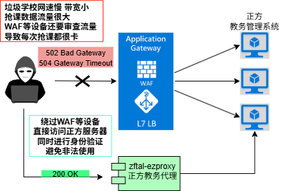

# zftal-ezproxy

一个简单的反代, 适配正方教务, 用于抢课等合法用途

具体功能还在开发和完善

---

很多学校的网络架构都是先经过WAF, 流量镜像, 流量审查, 负载均衡等一系列设备, 最后才到应用服务器上

经过这一系列的设备要损失很多性能, 导致经常性的一到抢课就卡甚至完全无法访问

其实经过测试, 正方教务应用服务器的占用都很低, 是前面这一大坨设备导致卡顿

为了解决正方教务抢课很慢的问题. 前提是, **你有权限直接访问到后端服务器**

---

